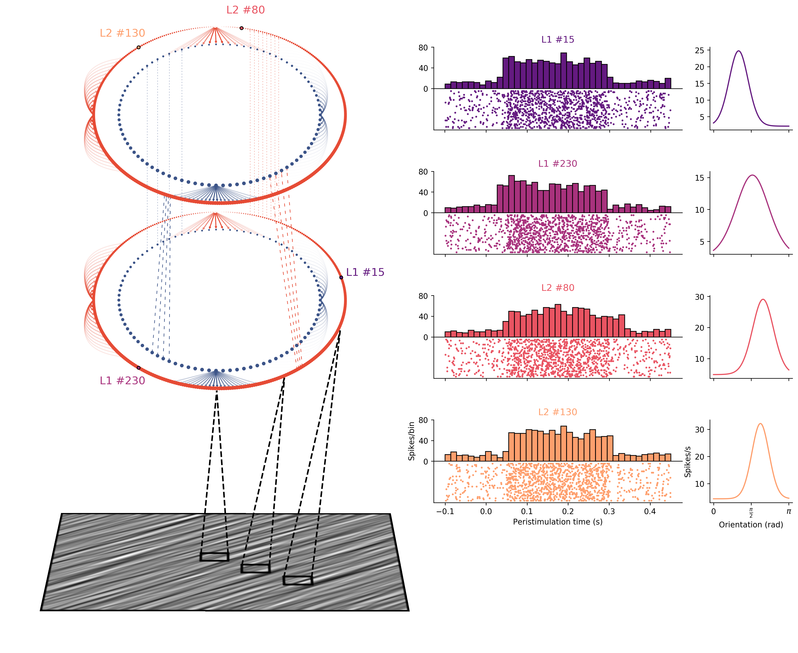

## Submission to the [John Hunter Excellence in Plotting Contest 2020](https://jhepc.github.io/about.html)

#### Figure title : A cortical neural network for the vision of natural textures 
#### Authors : Hugo Ladret
 
### Abstract
Spiking neural networks are a popular class of artificial neural networks based on biological learning architectures. These models use a binary temporal code of 'spikes' to create sparse and efficient encoding of inputs. In computer vision, such neural networks exhibit several interesting properties, one of which is orientation selectivity : the capacity for the neurons to encode the orientation of the visual input. Widely considered to be the very first step in the processing of visual informations, orientation selectivity has been extensively studied, modeled and subsequently plotted. In this context, data visualization must show the neural network structure while also conveying information about its activity.

Here, we use Matplotlib's flexibility  to provide a quick overview of such a neural network. The left side of the plot shows the layered structure of the network, with an example of input image displayed at the bottom left of the plot. Excitatory and inhibitory neurons are plotted in red and blue, respectively. We also plot a handful of examples for each type of neuronal connection (within layer, between neuron types, between layers, etc.). 

Users can specify a set of specific neurons for further display on the right side of the plot. For each of these neurons, we display the stimulation-by-stimulation spiking activity and associated histogram (also known as a 'peristimulus time histogram' or 'PSTH'). One can also quickly visualize the orientation selectivity of these neurons, given by the oriented/activity curve ('tuning curve') on the right side of these subplots.  

The data plotted here shows that neurons in the second layer (L2) of the neural network are more sparsely activated compared to L1 neurons. Nonetheless, both do exhibit an orientation selective activity, with varying degree of sharpness in their respective tuning curves. Overall, this kind of plot allows the reader to gain a quick and intuitive idea of the model, which can then be furthered with additional figures in a research paper.

-- 
About the data :

As this figure is part of a paper currently in preparation, full dataset cannot be publicly released. The plot is therefore based on a representative sub-sample of the complete neuronal activity dataset. 

In case one would want more than 4 neurons to be plotted, we do also include code that can generate fake data, but is unused in the submitted plot.  

### Acknowledgements
I'd like to thank [Laurent Perrinet](https://laurentperrinet.github.io/authors/laurent-u-perrinet/) for his supervision of the research project and his valuable feedback, as well as Louis Eparvier for early feedback on the figure layout.
